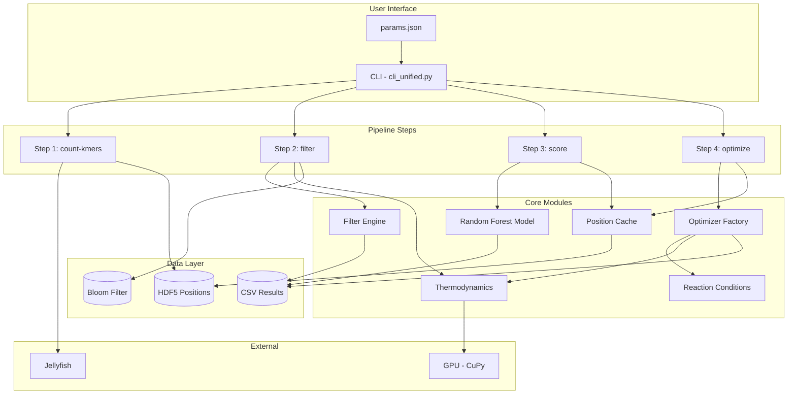
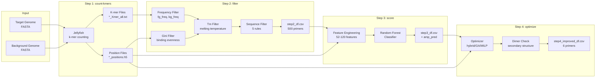
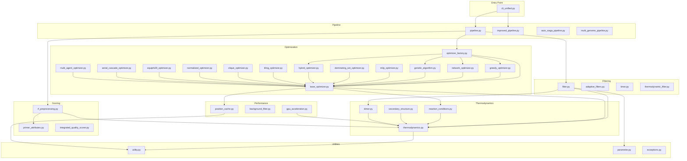
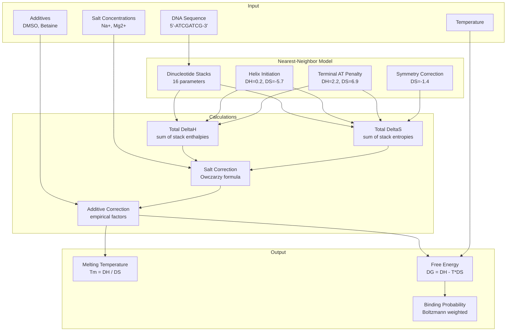
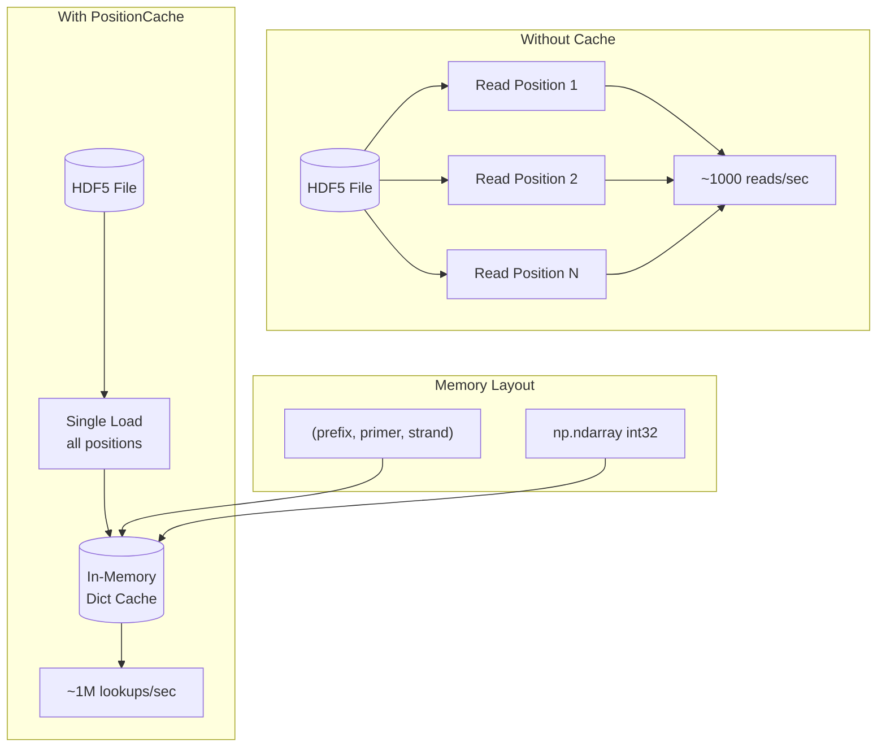
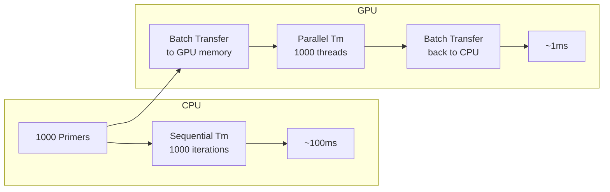
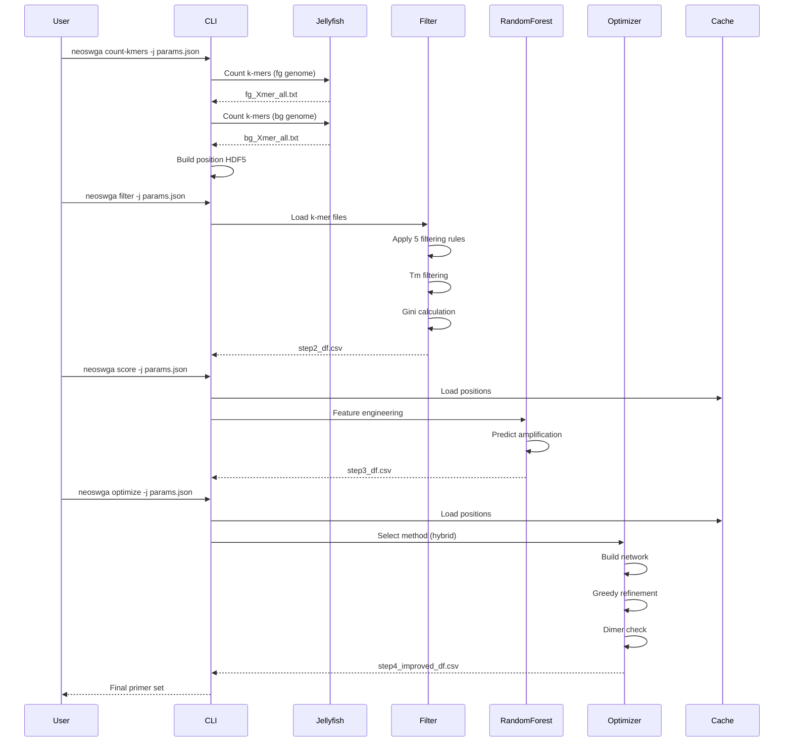
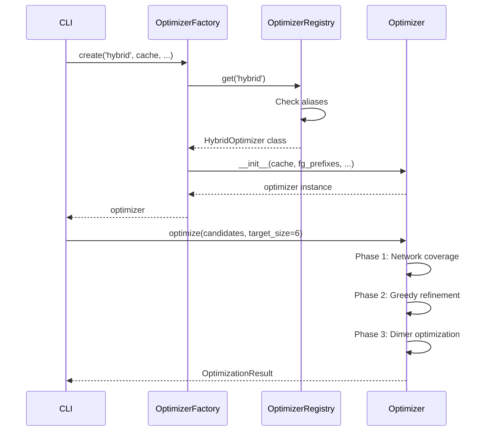

# NeoSWGA Architecture Diagrams

Visual documentation of the NeoSWGA system architecture, data flows, and component relationships.

## Table of Contents

1. [System Overview](#system-overview)
2. [Pipeline Data Flow](#pipeline-data-flow)
3. [Module Dependencies](#module-dependencies)
4. [Optimizer Architecture](#optimizer-architecture)
5. [Thermodynamic Calculations](#thermodynamic-calculations)
6. [Performance Optimization](#performance-optimization)

---

## System Overview

High-level architecture showing major components and their interactions.



---

## Pipeline Data Flow

Detailed view of data transformations through the pipeline.



---

## Module Dependencies

Import relationships between core modules.



---

## Optimizer Architecture

Factory pattern and optimizer inheritance hierarchy.

```mermaid
classDiagram
    class BaseOptimizer {
        <<abstract>>
        +cache: PositionCache
        +fg_prefixes: List[str]
        +fg_seq_lengths: List[int]
        +optimize(candidates, target_size) OptimizationResult
        #_calculate_metrics(primers) PrimerSetMetrics
    }

    class OptimizerFactory {
        +create(name, cache, ...) BaseOptimizer
        +list_optimizers() Dict[str, str]
    }

    class OptimizerRegistry {
        -_registry: Dict[str, Type]
        -_aliases: Dict[str, str]
        +register(name, aliases) Decorator
        +get(name) Type[BaseOptimizer]
    }

    class GreedyOptimizer {
        +optimize(candidates, target_size) OptimizationResult
        -_greedy_select(candidates) List[str]
    }

    class NetworkOptimizer {
        +network: AmplificationNetwork
        +optimize(candidates, target_size) OptimizationResult
        -_build_network(primers) None
        -_score_connectivity() float
    }

    class GeneticOptimizer {
        +config: GAConfig
        +population: List[Individual]
        +optimize(candidates, target_size) OptimizationResult
        -_evolve() Individual
        -_select_parents() List[Individual]
        -_crossover(p1, p2) Individual
        -_mutate(ind) Individual
    }

    class HybridOptimizer {
        +network_opt: NetworkOptimizer
        +greedy_opt: GreedyOptimizer
        +optimize(candidates, target_size) OptimizationResult
    }

    class DominatingSetOptimizer {
        +bin_size: int
        +optimize(candidates, target_size) OptimizationResult
        -_build_coverage_graph() Graph
        -_greedy_set_cover() Set[str]
    }

    class MILPOptimizer {
        +solver: mip.Model
        +optimize(candidates, target_size) OptimizationResult
        -_formulate_ilp() None
        -_solve() List[str]
    }

    class BackgroundAwareOptimizer {
        +stages: int
        +optimize(candidates, target_size) OptimizationResult
        -_stage1_coverage() List[str]
        -_stage2_background() List[str]
        -_stage3_dimers() List[str]
    }

    class OptimizationResult {
        +primer_set: List[str]
        +metrics: PrimerSetMetrics
        +status: OptimizationStatus
        +message: str
    }

    class PrimerSetMetrics {
        +fg_coverage: float
        +bg_coverage: float
        +selectivity_ratio: float
        +mean_tm: float
        +dimer_risk_score: float
        +gap_gini: float
        +normalized_score() float
    }

    class CompositeOptimizer {
        +optimizers: List[BaseOptimizer]
        +optimize(candidates, target_size) OptimizationResult
    }

    class TilingOptimizer {
        +optimize(candidates, target_size) OptimizationResult
    }

    class NormalizedOptimizer {
        +strategy: str
        +optimize(candidates, target_size) OptimizationResult
    }

    class CliqueOptimizer {
        +optimize(candidates, target_size) OptimizationResult
    }

    class EquiPhi29Optimizer {
        +optimize(candidates, target_size) OptimizationResult
    }

    class MultiAgentOrchestrator {
        +strategies: List
        +optimize(candidates, target_size) OptimizationResult
    }

    class SerialCascadeOptimizer {
        +stages: List[BaseOptimizer]
        +optimize(candidates, target_size) OptimizationResult
    }

    OptimizerFactory --> OptimizerRegistry
    OptimizerRegistry --> BaseOptimizer
    BaseOptimizer <|-- GreedyOptimizer
    BaseOptimizer <|-- NetworkOptimizer
    BaseOptimizer <|-- GeneticOptimizer
    BaseOptimizer <|-- HybridOptimizer
    BaseOptimizer <|-- DominatingSetOptimizer
    BaseOptimizer <|-- MILPOptimizer
    BaseOptimizer <|-- BackgroundAwareOptimizer
    BaseOptimizer <|-- TilingOptimizer
    BaseOptimizer <|-- NormalizedOptimizer
    BaseOptimizer <|-- CliqueOptimizer
    BaseOptimizer <|-- EquiPhi29Optimizer
    BaseOptimizer <|-- MultiAgentOrchestrator
    BaseOptimizer <|-- SerialCascadeOptimizer
    BaseOptimizer <|-- CompositeOptimizer

    HybridOptimizer --> NetworkOptimizer
    HybridOptimizer --> GreedyOptimizer

    BaseOptimizer --> OptimizationResult
    OptimizationResult --> PrimerSetMetrics
```



---

## Thermodynamic Calculations

Nearest-neighbor model calculation flow.



### SantaLucia Parameters Table

| Stack | DeltaH (kcal/mol) | DeltaS (cal/mol*K) |
|-------|-------------------|---------------------|
| AA/TT | -7.9 | -22.2 |
| AT/TA | -7.2 | -20.4 |
| TA/AT | -7.2 | -21.3 |
| CA/GT | -8.5 | -22.7 |
| GT/CA | -8.4 | -22.4 |
| CT/GA | -7.8 | -21.0 |
| GA/CT | -8.2 | -22.2 |
| CG/GC | -10.6 | -27.2 |
| GC/CG | -9.8 | -24.4 |
| GG/CC | -8.0 | -19.9 |

---

## Performance Optimization

Caching and acceleration strategies.



### GPU Acceleration



### Bloom Filter for Background

```mermaid
flowchart TB
    subgraph "Traditional Approach"
        BGFILE[(Background k-mers<br/>3 GB file)]
        BGMEM[Load to Memory<br/>~8 GB RAM]
        LOOKUP1[Dict Lookup<br/>O(1)]
    end

    subgraph "Bloom Filter Approach"
        BUILD[One-time Build<br/>~30 min]
        BLOOM[(Bloom Filter<br/>~100 MB)]
        LOOKUP2[Membership Test<br/>O(1)]
        FP[False Positive<br/>~1%]
    end

    BGFILE --> BGMEM
    BGMEM --> LOOKUP1

    BGFILE --> BUILD
    BUILD --> BLOOM
    BLOOM --> LOOKUP2
    LOOKUP2 --> FP
```

---

## Sequence Diagrams

### Pipeline Execution



### Optimizer Selection



---

## Component Summary

| Component | Purpose | Key Files |
|-----------|---------|-----------|
| CLI | User interface | cli_unified.py |
| Pipeline | Workflow orchestration | pipeline.py, improved_pipeline.py |
| Filtering | Primer candidate selection | filter.py, adaptive_filters.py |
| Scoring | ML-based ranking | rf_preprocessing.py, primer_attributes.py |
| Optimization | Set selection (18 strategies) | optimizer_factory.py, base_optimizer.py, unified_optimizer.py |
| Thermodynamics | NN calculations | thermodynamics.py, reaction_conditions.py |
| Mechanistic | Four-pathway amplification model | mechanistic_model.py, additives.py |
| Performance | Speed optimization | position_cache.py, gpu_acceleration.py |
| Analysis | Post-processing | genome_analysis.py, dimer_network_analyzer.py |
| Simulation | Replication modeling | replication_simulator.py, swga_simulator.py |
| Reporting | Quality reports (A-F grades) | report/quality.py, report/executive_summary.py |
| Export | Synthesis ordering formats | export.py |

---

## See Also

- [API Reference](API_REFERENCE.md) - Complete API documentation
- [User Guide](user-guide.md) - Usage tutorials
- [Algorithms](development/algorithms.md) - Algorithm details
