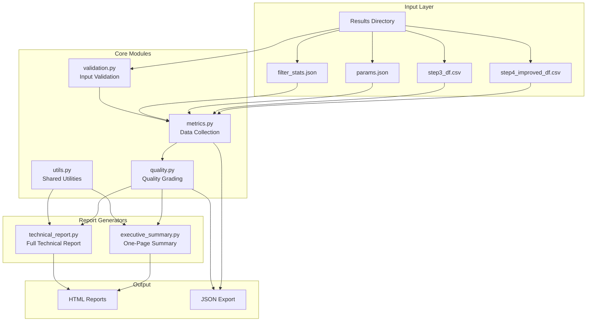

# NeoSWGA Report Module Documentation

## Overview

The Report Module provides comprehensive quality assessment and report generation for SWGA primer sets. It transforms pipeline output into actionable reports with letter grades (A-F), visualizations, and recommendations.

## Architecture



## Module Reference

Class and function signatures for `metrics.py`, `quality.py`, `validation.py`, `executive_summary.py`, `technical_report.py` and `utils.py` live in [Report API Reference](api_reference_report.md); this document does not repeat them.

## CLI Usage

### Generate Report

```bash
# Executive summary (default)
neoswga report -d results/

# Full technical report
neoswga report -d results/ --level full

# JSON output
neoswga report -d results/ --format json

# Custom output path
neoswga report -d results/ -o my_report.html

# Validation only (no report generated)
neoswga report -d results/ --check

# Quiet mode (suppress progress)
neoswga report -d results/ -q
```

### CLI Options

| Option | Description |
|--------|-------------|
| `-d, --dir` | Results directory (required) |
| `-o, --output` | Output file path |
| `--format` | Output format: `html` or `json` |
| `--level` | Report level: `summary` or `full` |
| `--check` | Validate only, don't generate |
| `-q, --quiet` | Suppress progress messages |

---

## Python API

### Quick Start

```python
from neoswga.core.report import (
    generate_executive_summary,
    generate_technical_report,
    collect_pipeline_metrics,
    calculate_quality_grade,
)

# Option 1: Generate executive summary
summary = generate_executive_summary("results/", "summary.html")

# Option 2: Generate technical report
report = generate_technical_report("results/", "technical.html")

# Option 3: Manual control
metrics = collect_pipeline_metrics("results/")
quality = calculate_quality_grade(metrics)

print(f"Primers: {metrics.primer_count}")
print(f"Grade: {quality.grade.value} ({quality.composite_score:.2f})")
print(f"Recommendation: {quality.recommendation}")
```

### Validation Example

```python
from neoswga.core.report.validation import (
    validate_results_directory,
    validate_metrics,
    ValidationLevel,
)
from neoswga.core.report.metrics import collect_pipeline_metrics

# Validate directory first
dir_result = validate_results_directory("results/")
if not dir_result.is_valid:
    for error in dir_result.errors:
        print(f"ERROR: {error.message}")
    exit(1)

# Collect and validate metrics
metrics = collect_pipeline_metrics("results/")
metrics_result = validate_metrics(metrics)

for warning in metrics_result.warnings:
    print(f"WARNING: {warning.message}")
```

---

## File Format Reference

### step4_improved_df.csv

Final optimized primer set with all metrics.

| Column | Type | Description |
|--------|------|-------------|
| sequence | str | Primer sequence |
| score | float | Optimization score |
| fg_freq | float | Foreground frequency |
| bg_freq | float | Background frequency |
| tm | float | Melting temperature (C) |
| gini | float | Uniformity index (0-1) |
| gc | float | GC content (0-1) |
| fg_count | int | Foreground binding sites |
| bg_count | int | Background binding sites |
| amp_pred | float | Amplification prediction |
| dimer_score | float | Dimer formation score |

### params.json

Pipeline parameters.

```json
{
    "fg": "/path/to/target.fna",
    "bg": "/path/to/background.fna",
    "fg_size": 5220000,
    "bg_size": 50818468,
    "min_k": 10,
    "max_k": 12,
    "polymerase": "phi29",
    "num_primers": 6
}
```

### filter_stats.json

Filtering funnel statistics.

```json
{
    "total_kmers": 2097152,
    "after_frequency": 125000,
    "after_background": 8500,
    "after_gini": 2200,
    "after_thermodynamic": 850,
    "final_candidates": 6
}
```

---

## Security Considerations

The report module includes protections against:

1. **XSS Prevention**: All user-controlled content is HTML-escaped before rendering
2. **Format String Injection**: Braces in user content are escaped to prevent template injection
3. **Path Traversal**: File paths are validated before access

---

## Testing

```bash
# Run all report module tests
pytest tests/report/ -v

# Run with coverage
pytest tests/report/ --cov=neoswga.core.report --cov-report=html

# Run specific test class
pytest tests/report/test_quality.py::TestCalculateQualityGrade -v
```

### Test Coverage

| Module | Coverage |
|--------|----------|
| quality.py | 100% |
| metrics.py | 95% |
| executive_summary.py | 90% |
| utils.py | 86% |
| validation.py | 68% |
