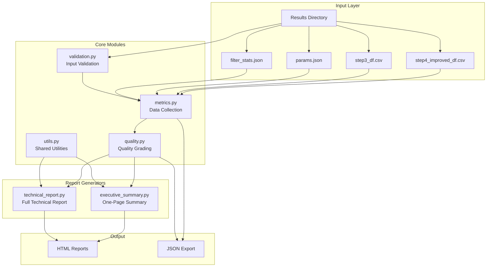

# NeoSWGA Report Module Documentation

## Overview

The Report Module provides comprehensive quality assessment and report generation for SWGA primer sets. It transforms pipeline output into actionable reports with letter grades (A-F), visualizations, and recommendations.

## Architecture



## Module Reference

### metrics.py

Collects and standardizes metrics from pipeline output files.

#### Classes

##### `PrimerMetrics`

Metrics for a single primer.

```python
@dataclass
class PrimerMetrics:
    sequence: str           # Primer sequence
    length: int             # Sequence length (bp)
    gc_content: float       # GC content (0-1)
    tm: float               # Melting temperature (C)
    fg_freq: float          # Foreground frequency
    bg_freq: float          # Background frequency
    fg_sites: int           # Foreground binding sites
    bg_sites: int           # Background binding sites
    gini: float             # Gini uniformity index (0-1)
    specificity: float      # fg_freq / bg_freq ratio
    amp_pred: float         # Amplification prediction score
    dimer_score: float      # Dimer formation score
    hairpin_dg: float       # Hairpin delta-G (kcal/mol)
    self_dimer_dg: float    # Self-dimer delta-G (kcal/mol)
    three_prime_stability: float  # 3' end stability
    strand_ratio: float     # Forward/reverse strand ratio
```

##### `PipelineMetrics`

Complete metrics from a pipeline run.

```python
@dataclass
class PipelineMetrics:
    primers: List[PrimerMetrics]
    primer_count: int
    target_genome_size: int
    background_genome_size: int
    parameters: Dict[str, Any]
    filtering: Optional[FilteringStats]
    coverage: Optional[CoverageMetrics]
    specificity: Optional[SpecificityMetrics]
    uniformity: Optional[UniformityMetrics]
    thermodynamics: Optional[ThermodynamicMetrics]
```

#### Functions

##### `collect_pipeline_metrics(results_dir: str) -> PipelineMetrics`

Collect all metrics from a pipeline results directory.

**Parameters:**
- `results_dir`: Path to the results directory containing pipeline output

**Returns:**
- `PipelineMetrics` object with all collected data

**Example:**
```python
from neoswga.core.report.metrics import collect_pipeline_metrics

metrics = collect_pipeline_metrics("results/bacillus/")
print(f"Primers: {metrics.primer_count}")
print(f"Target size: {metrics.target_genome_size:,} bp")
```

---

### quality.py

Quality grading system using weighted metrics.

#### Grading Weights

| Component | Weight | Description |
|-----------|--------|-------------|
| Coverage | 35% | Genome coverage by primer binding sites |
| Specificity | 30% | Enrichment ratio (target vs background) |
| Uniformity | 20% | Binding site distribution evenness |
| Thermodynamics | 10% | Tm range consistency |
| Dimer Risk | 5% | Primer-dimer formation potential |

#### Grade Thresholds

| Grade | Score Range | Recommendation |
|-------|-------------|----------------|
| A | >= 0.85 | Ready for synthesis |
| B | 0.70 - 0.84 | Good - minor concerns |
| C | 0.55 - 0.69 | Acceptable - consider optimization |
| D | 0.40 - 0.54 | Poor - optimization recommended |
| F | < 0.40 | Critical - do not proceed |

#### Classes

##### `QualityGrade`

Enumeration of quality grades.

```python
class QualityGrade(Enum):
    A = "A"  # Excellent
    B = "B"  # Good
    C = "C"  # Acceptable
    D = "D"  # Poor
    F = "F"  # Critical
```

##### `QualityAssessment`

Complete quality assessment result.

```python
@dataclass
class QualityAssessment:
    grade: QualityGrade
    composite_score: float  # 0-1 scale
    components: List[GradeComponent]
    recommendation: str
    recommendation_details: str
    considerations: List[str]
```

#### Functions

##### `calculate_quality_grade(metrics: PipelineMetrics) -> QualityAssessment`

Calculate quality grade from pipeline metrics.

**Parameters:**
- `metrics`: PipelineMetrics from collect_pipeline_metrics()

**Returns:**
- `QualityAssessment` with grade, score, and recommendations

**Example:**
```python
from neoswga.core.report.quality import calculate_quality_grade

quality = calculate_quality_grade(metrics)
print(f"Grade: {quality.grade.value}")
print(f"Score: {quality.composite_score:.2f}")
print(f"Recommendation: {quality.recommendation}")
```

---

### validation.py

Input validation before report generation.

#### Severity Levels

| Level | Description |
|-------|-------------|
| ERROR | Blocks report generation |
| WARNING | Should be noted but doesn't block |
| INFO | Informational message |

#### Functions

##### `validate_results_directory(path: str) -> ValidationResult`

Validate a results directory before report generation.

**Checks performed:**
- Directory exists
- Required file present: `step4_improved_df.csv`
- Optional files: `step3_df.csv`, `step2_df.csv`, `params.json`

**Example:**
```python
from neoswga.core.report.validation import validate_results_directory

result = validate_results_directory("results/")
if not result.is_valid:
    for error in result.errors:
        print(f"ERROR: {error.message}")
```

##### `validate_metrics(metrics: PipelineMetrics) -> ValidationResult`

Validate collected metrics for completeness.

**Checks performed:**
- At least one primer present
- Genome size specified
- Key metrics have valid values

---

### executive_summary.py

Generates a one-page HTML executive summary.

#### Functions

##### `generate_executive_summary(results_dir: str, output_file: str = None) -> ExecutiveSummary`

Generate an executive summary report.

**Parameters:**
- `results_dir`: Path to results directory
- `output_file`: Optional path to write HTML output

**Returns:**
- `ExecutiveSummary` object with metrics and quality assessment

**Example:**
```python
from neoswga.core.report import generate_executive_summary

summary = generate_executive_summary(
    results_dir="results/",
    output_file="report.html"
)
print(f"Grade: {summary.quality.grade.value}")
```

---

### technical_report.py

Generates comprehensive multi-page technical reports.

#### Functions

##### `generate_technical_report(results_dir: str, output_file: str = None) -> TechnicalReportData`

Generate a full technical report.

**Includes:**
- Pipeline execution summary
- Filtering funnel visualization
- Coverage analysis
- Specificity analysis
- Thermodynamic properties
- Per-primer detailed analysis
- Primer-primer interactions
- Recommendations

---

### utils.py

Shared utilities for report generation.

#### Functions

##### `escape_format_braces(text: str) -> str`

Escape braces to prevent format string injection.

##### `get_grade_colors(grade: QualityGrade) -> Dict[str, str]`

Get color scheme for a quality grade.

**Returns dict with keys:**
- `grade_bg`: Background color
- `grade_color`: Text color
- `grade_text`: Alternative text color
- `rec_bg`: Recommendation background
- `rec_border`: Recommendation border
- `rec_color`: Recommendation text

##### `get_rating_class(rating: str) -> str`

Get CSS class for a rating level.

##### `get_progress_class(rating: str) -> str`

Get CSS class for progress bar styling.

---

## CLI Usage

### Generate Report

```bash
# Executive summary (default)
neoswga report -d results/

# Full technical report
neoswga report -d results/ --level full

# JSON output
neoswga report -d results/ --format json

# Custom output path
neoswga report -d results/ -o my_report.html

# Validation only (no report generated)
neoswga report -d results/ --check

# Quiet mode (suppress progress)
neoswga report -d results/ -q
```

### CLI Options

| Option | Description |
|--------|-------------|
| `-d, --dir` | Results directory (required) |
| `-o, --output` | Output file path |
| `--format` | Output format: `html` or `json` |
| `--level` | Report level: `summary` or `full` |
| `--check` | Validate only, don't generate |
| `-q, --quiet` | Suppress progress messages |

---

## Python API

### Quick Start

```python
from neoswga.core.report import (
    generate_executive_summary,
    generate_technical_report,
    collect_pipeline_metrics,
    calculate_quality_grade,
)

# Option 1: Generate executive summary
summary = generate_executive_summary("results/", "summary.html")

# Option 2: Generate technical report
report = generate_technical_report("results/", "technical.html")

# Option 3: Manual control
metrics = collect_pipeline_metrics("results/")
quality = calculate_quality_grade(metrics)

print(f"Primers: {metrics.primer_count}")
print(f"Grade: {quality.grade.value} ({quality.composite_score:.2f})")
print(f"Recommendation: {quality.recommendation}")
```

### Validation Example

```python
from neoswga.core.report.validation import (
    validate_results_directory,
    validate_metrics,
    ValidationLevel,
)
from neoswga.core.report.metrics import collect_pipeline_metrics

# Validate directory first
dir_result = validate_results_directory("results/")
if not dir_result.is_valid:
    for error in dir_result.errors:
        print(f"ERROR: {error.message}")
    exit(1)

# Collect and validate metrics
metrics = collect_pipeline_metrics("results/")
metrics_result = validate_metrics(metrics)

for warning in metrics_result.warnings:
    print(f"WARNING: {warning.message}")
```

---

## File Format Reference

### step4_improved_df.csv

Final optimized primer set with all metrics.

| Column | Type | Description |
|--------|------|-------------|
| sequence | str | Primer sequence |
| score | float | Optimization score |
| fg_freq | float | Foreground frequency |
| bg_freq | float | Background frequency |
| tm | float | Melting temperature (C) |
| gini | float | Uniformity index (0-1) |
| gc | float | GC content (0-1) |
| fg_count | int | Foreground binding sites |
| bg_count | int | Background binding sites |
| amp_pred | float | Amplification prediction |
| dimer_score | float | Dimer formation score |

### params.json

Pipeline parameters.

```json
{
    "fg": "/path/to/target.fna",
    "bg": "/path/to/background.fna",
    "fg_size": 5220000,
    "bg_size": 50818468,
    "min_k": 10,
    "max_k": 12,
    "polymerase": "phi29",
    "num_primers": 6
}
```

### filter_stats.json

Filtering funnel statistics.

```json
{
    "total_kmers": 2097152,
    "after_frequency": 125000,
    "after_background": 8500,
    "after_gini": 2200,
    "after_thermodynamic": 850,
    "final_candidates": 6
}
```

---

## Security Considerations

The report module includes protections against:

1. **XSS Prevention**: All user-controlled content is HTML-escaped before rendering
2. **Format String Injection**: Braces in user content are escaped to prevent template injection
3. **Path Traversal**: File paths are validated before access

---

## Testing

```bash
# Run all report module tests
pytest tests/report/ -v

# Run with coverage
pytest tests/report/ --cov=neoswga.core.report --cov-report=html

# Run specific test class
pytest tests/report/test_quality.py::TestCalculateQualityGrade -v
```

### Test Coverage

| Module | Coverage |
|--------|----------|
| quality.py | 100% |
| metrics.py | 95% |
| executive_summary.py | 90% |
| utils.py | 86% |
| validation.py | 68% |
