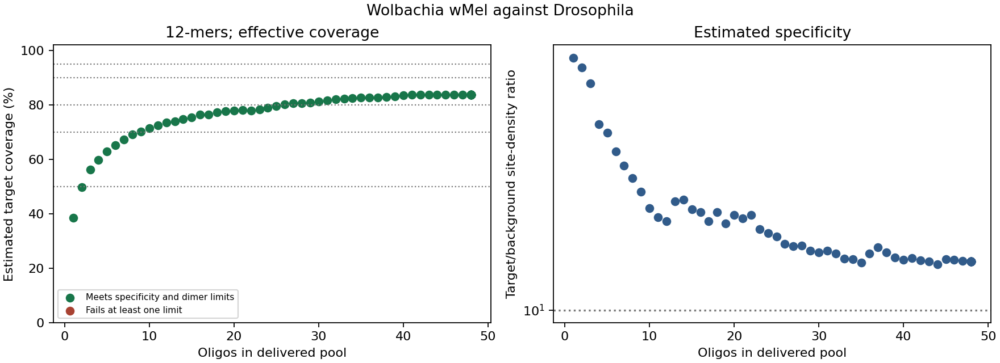

# Wolbachia wMel oligo pool example

This example compares pools of specific 12-mers against Wolbachia wMel, using
the full Drosophila melanogaster reference as background. The objective is a
small pool that meets estimated coverage and specificity limits together.
The saved [report](results/pool_plan.html) includes the comparison figure,
evaluated sequences and FASTA exports for qualifying coverage targets.

## Saved results

| Coverage target | Smallest pool found | Estimated coverage | Density ratio | Exact host sites |
|---|---:|---:|---:|---:|
| 50% | 3 | 56.1% | 61.49 | 45 |
| 70% | 9 | 70.3% | 25.80 | 124 |
| 80% | 26 | 80.1% | 16.96 | 291 |
| 90% | None found | - | - | - |
| 95% | None found | - | - | - |

The highest estimated effective coverage was 83.8% with 48 oligos (raw window
coverage 84.2%, density ratio 14.72, 618 exact host sites). Requested sizes
above 48 returned a partial panel of 48. All evaluated panels passed the fixed
specificity and dimer limits. No 90% or 95% FASTA recommendation was exported.
The saved search therefore supports an 80% design checkpoint but does not
establish a panel for near-complete genome recovery. Further comparisons could
evaluate other candidate lengths or candidate-pool selection before laboratory
validation; the current results do not determine which alternative will work.



## References

- Target: [NC_002978.6](https://www.ncbi.nlm.nih.gov/nuccore/NC_002978.6),
  Wolbachia endosymbiont of Drosophila melanogaster wMel; 1,267,782 bases.
- Background: [GCF_000001215.4](https://www.ncbi.nlm.nih.gov/datasets/genome/GCF_000001215.4/),
  Drosophila melanogaster Release 6 plus ISO1 MT; the supplied FASTA contains
  143,726,002 bases across 1,870 records.

Input FASTAs and intermediate indexes are excluded from version control.
`results/reference_provenance.json` records input hashes and sequence counts.

## Interpretation

The example uses a 2,000-candidate pool, phi29 model at 30 C, no added betaine
or DMSO, circular target coordinates, and a 3,000 bp coverage-window radius.
The coverage metric weights each primer's reachable windows by modeled binding
occupancy. It does not simulate sequencing depth or establish genome recovery.
Both exact and reverse-complement target sites contribute to the existing
window model; strand-directed extension and amplification kinetics are not
resolved by this estimate.

The minimum target/background site-density ratio is 10, an illustrative
comparison threshold. The ratio is based on occupancy-weighted loads per
reference base, including the application's modeled mismatch contribution to
background load. It is not measured fold enrichment. Exact host matches are
also reported, without a separate count limit in this example. Sample target
abundance and laboratory performance require independent assessment.

The pairwise dimer limit is 3 bp and self-dimer limit is 4 bp, using the
application's sequence-complementarity checks. Limits are kept fixed across
pool sizes. Recommendations are the smallest qualifying panels found in a
bounded heuristic search over this candidate pool, not proven minimum sizes.
Each requested size is optimized separately; panels need not be nested and
coverage need not increase at every size. A failed target is not evidence that
no suitable pool exists.

## Reproduce

From the repository root, place the target FASTA in
`examples/wolbachia_pool_design/input/wmel.fna` and the background FASTA in
`examples/wolbachia_pool_design/input/drosophila.fna`.
The background is available from the
[NCBI assembly download](https://ftp.ncbi.nlm.nih.gov/genomes/all/GCF/000/001/215/GCF_000001215.4_Release_6_plus_ISO1_MT/GCF_000001215.4_Release_6_plus_ISO1_MT_genomic.fna.gz);
decompress it before use. Export the target as FASTA from its linked accession.

```bash
python examples/wolbachia_pool_design/prepare.py
neoswga count-kmers -j examples/wolbachia_pool_design/params.json
neoswga filter -j examples/wolbachia_pool_design/params.json
neoswga score -j examples/wolbachia_pool_design/params.json
neoswga plan-pool -j examples/wolbachia_pool_design/params.json \
  --primer-length 12 --min-size 1 --max-size 64 \
  --coverage-targets 0.5 0.7 0.8 0.9 0.95 \
  --min-selectivity-density 10 --swap-max-evaluations 100000 \
  --title 'Wolbachia wMel against Drosophila' -o wmel_pool_plan
```

`prepare.py` resolves the portable parameter template to local absolute paths.
Use a fresh report output directory for a new run. The saved comparison was
evaluated in two batches (sizes 1-24 and 25-64) with the same inputs and search
settings. The report JSON retains their provenance. Time limits can affect
heuristic search results on a slower system.
